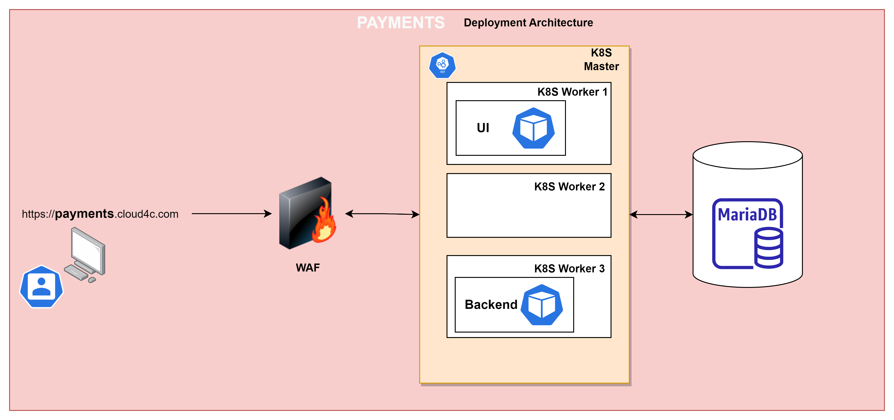
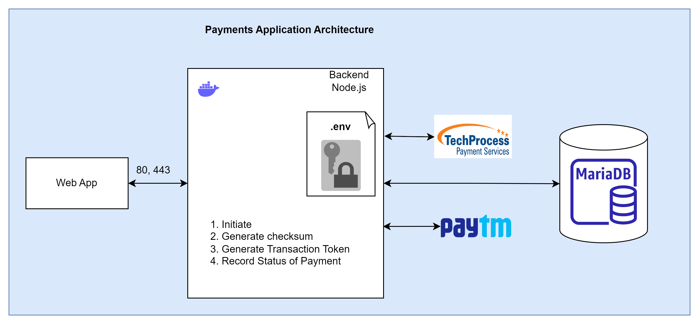

# payments-app-v2

## steps:
>clone the project

>To run the backend

>run ```cd backend```

>run ```npm install``` 

>to run the code type ```npx tsc``` // this will create a build 

>run ```npm start``` to start the backend 

>To run frontend

>run ```cd frontend```

>run ```npm install``` 

>run ```npm start``` to start the backend 

>open frontend with 127.0.0.1:port instead localhost:port for reCAPTCHA.

## Payments Deployement Architecture Diagram
> 


## Payment gateways Achitecture Diagram
