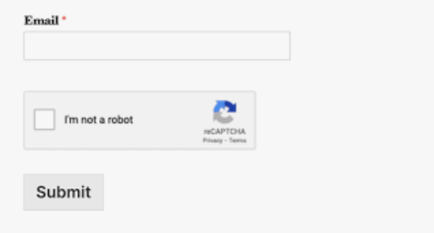

# reCAPTCHA v2 documentation

## Prerequsites:
> create account in google reCAPTCHA console and enable v2
> select any option

    ```I'm not a robot```

    ```Invisible```

    ```reCAPTCHA Android```

> Enter few details like in which host you want to see the reCAPTCHA and for localhost give ```127.0.0.1``` and submit

> console will provide SITE_KEY and SECRET_KEY 

## step 1:

> To view the reCAPTCHA add the following code in Frontend(sample code)

```
<!DOCTYPE html>
<html lang="en">
<head>
    <meta charset="UTF-8">
    <meta http-equiv="X-UA-Compatible" content="IE=edge">
    <meta name="viewport"
          content="width=device-width, initial-scale=1.0">
    <!-- CSS file -->
    <link rel="stylesheet" href="style.css">
    <!-- Google reCAPTCHA CDN -->
    <script src="https://www.google.com/recaptcha/api.js" async defer> </script>
</head>
<body>
    <div class="container">
        <h1>Google recaptcha</h1>
        <!-- HTML Form -->
        <form action="/submit" method="post">
            <input type="text" name="Email" id="email"
                   placeholder=" " required>
            <br>
            <!-- div to show reCAPTCHA -->
            <div class="g-recaptcha"
                 data-sitekey="SITE_KEY"> // replace with your SITE_KEY
            </div>
            <br>
            <button type="submit">Submit</button>
        </form>
    </div>
</body>
</html>
```


>To check at serverend 

```
app.post("/submit", (req, res) => {
    const name = req.body.name;
    // getting site key from client side
    const response_key = req.body["g-recaptcha-response"];
    // Put secret key here, which we get from google console
    const secret_key = "SECRET_KEY";
    // Hitting POST request to the URL, Google will
    // respond with success or error scenario.
    const url =
        `https://www.google.com/recaptcha/api/siteverify?secret=${secret_key}&response=${response_key}`;
    // Making POST request to verify captcha
    fetch(url, {
        method: "post",
    })
        .then((response) => response.json())
        .then((google_response) => {
            // google_response is the object return by
            // google as a response
            if (google_response.success == true) {
                //   if captcha is verified
                return res.send({ response: "Successful" });
            } else {
                // if captcha is not verified
                return res.send({ response: "Failed" });
            }
        })
        .catch((error) => {
            // Some error while verify captcha
            return res.json({ error });
        });
});
```

> If a user is verified we will get successful as response else failed 
