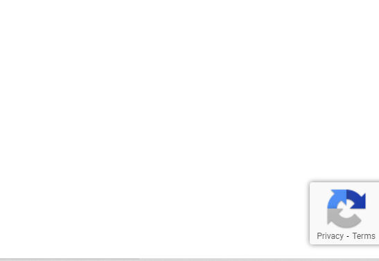

# reCAPTCHA v2 documentation

## Prerequsites:
> create account in google reCAPTCHA console and enable v3 

> v3 works with user click count. 

    ```Invisible```

> Enter few details like in which host you want to see the reCAPTCHA and for localhost give ```127.0.0.1``` and submit

> console will provide SITE_KEY and SECRET_KEY 

## step 1:

> To view the reCAPTCHA add the following code in Frontend(sample code), v3 will not support I'm not robot. it has only invisible 

```
<!DOCTYPE html>
<html lang="en">
<head>
    <meta charset="UTF-8">
    <meta http-equiv="X-UA-Compatible" content="IE=edge">
    <meta name="viewport"
          content="width=device-width, initial-scale=1.0">
    <!-- CSS file -->
    <link rel="stylesheet" href="style.css">
    <!-- Google reCAPTCHA CDN -->
    <script src="https://www.google.com/recaptcha/api.js" async defer> </script>
</head>
<body>
    <div class="container">
        <h1>Google recaptcha</h1>
        <!-- HTML Form -->
        <form action="/submit" method="post">
            <input type="text" name="Email" id="email"
                   placeholder=" " required>
            <br>
            <!-- div to show reCAPTCHA -->
            <div class="g-recaptcha"
                 data-sitekey="SITE_KEY"> // replace with your SITE_KEY
            </div>
            <br>
            <button type="submit">Submit</button>
        </form>
    </div>
</body>
</html>
```


>To check at serverend 
 replace your SECRET_KEY 
```
app.post('/captcha', function (req, res) {
    if (req.body['g-recaptcha-response'] === undefined || req.body['g-recaptcha-response'] === '' || req.body['g-recaptcha-response'] === null) {
        return res.json({ "responseError": "something goes to wrong" });
    }
    const secretKey = "SECRET_KEY"
    const verificationURL = "https://www.google.com/recaptcha/api/siteverify?secret=" + secretKey + "&response=" + req.body['g-recaptcha-response'] + "&remoteip=" + req.connection.remoteAddress;
    request(verificationURL, function (error, response, body) {
        body = JSON.parse(body);
        if (body.success !== undefined && !body.success) {
            return res.json({ "responseError": "Failed captcha verification" });
        }
        res.json({ "responseSuccess": "Sucess" });
    });
});
```
> If a user is verified we will get Sucess as response else Failed captcha verification 
